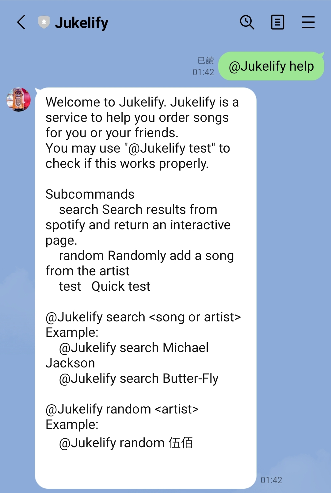

# Jukelify
Jukelify = Jukebox + Line + Spotify  
Jukelify is a service to help you order songs for you and your friends. You can search, randomly pick a song and push it to Spotify play queue.

## Setup environment
1. Setup environment variable 
   This repo use .env file to store environment variables. There is already a template .env.template for you. You can fill in the environment variables and rename the .env.template to .env.

        $ mv .env.template .env

2. Get refresh token and access token for Spotify 
   Spotify uses Oauth. Every secured api needs access token for authenticated calls. Access token has expired time. Everytime when an access token is expired, we need a refresh token to renew the access token. The package Spotipy does this for us. However, we still need to generate the first refresh token. Run the script `gen_refresh_token.py` to generate the first refresh token in spotify.cache.

        $ python gen_refresh_token.py

3. Deploy/ Start the server  
   - On any machine which has https certificate

        $ make serve
   - Use vercel to deploy

## Usage
Currently there are 3 commands: `search`, `random`, `test`. You can type `@Jukelify help` to see the details in Line.  

### search
You can search song or artist by `@Jukelify search <artist | song>`

- search for artist
   

https://github.com/YYLIZH/jukelify/assets/48501277/aa4ad818-e044-4595-bd06-18fc907ecedd

- search for song
  

https://github.com/YYLIZH/jukelify/assets/48501277/24abf9cc-2850-43b8-9e34-e66d899dc73f

### random
Seeking a surprize? You can try with random command by `@Jukelify random <artist>`. Jukelify will randomly pick a song for you.
- random
  

https://github.com/YYLIZH/jukelify/assets/48501277/4ccaf959-f333-4418-b8a5-96d03dc96d90

### test
Quick test if you can add song into your play queue.
   
